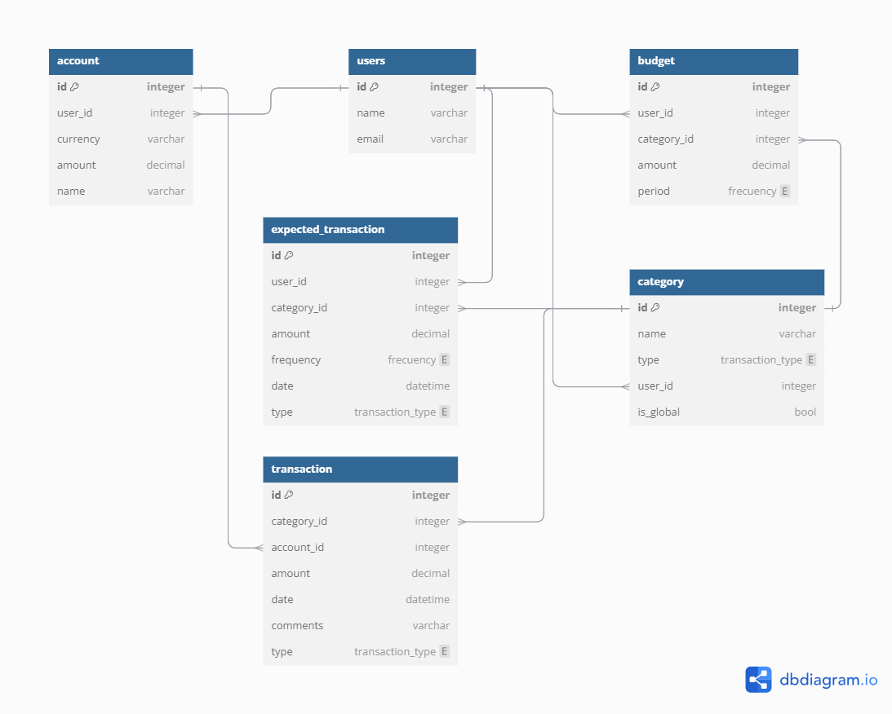

* [Go to markospy](https://github.com/markospy)

**Status:** **en** **desarrollo**

# **Sistema de Gestión de Finanzas Personales**

Este proyecto es una aplicación web y móvil para ayudar a los usuarios a gestionar sus finanzas personales.

## **Características principales**
* Registro de ingresos y gastos
* Categorización de transacciones
* Creación y seguimiento de presupuestos
* Visualización de reportes y estadísticas
* Versión web y móvil

## **Tecnologías utilizadas**
### Backend
* Python
* FastAPI
* PostgreSQL
### Frontend Web
* React
* TypeScript
* Vite
### Frontend Móvil
* React Native
* Expo
### Infraestructura
* Docker
* Docker Compose

## **Estructura del proyecto**

```
personal_finance_management/
├── backend/
│   └── app/
├── frontend/
│   ├── web/
│   └── movil/
├── docker-compose-dev.yml
└── README.md
```

## **Configuración del entorno de desarrollo**
1. Clona el repositorio
2. Instala Docker y Docker Compose
3. Crea el archivo *.env.develoment* en la ruta *.backend/app* y copia el siguiente contenido:
```
POSTGRES_USER = "my_user"
POSTGRES_PASSWORD = "my_password"
POSTGRES_DB = "my_database"
PORT = 5432
HOST = "db"

# to get a string like this run:
# openssl rand -hex 32
SECRET_KEY = "09d25e094faa6ca2556c818166b7a9563b93f7099f6f0f4caa6cf63b88e8d3e7"
ALGORITHM = "HS256"
ACCESS_TOKEN_EXPIRE_MINUTES = 1440 # 24 horas
```
4. Ejecuta docker compose -f docker-compose-dev.yml up.

Esto levantará los contenedores de:

* Backend (FastAPI)
* Frontend Web (React)
* Frontend Móvil (React Native)
* Base de datos (PostgreSQL)
* PHPMyAdmin

## **Modelo entidad-relación**


## **Contribuir**
Si deseas contribuir al proyecto, por favor:

1. Haz un fork del repositorio
2. Crea una nueva rama con tu funcionalidad
3. Haz commit de tus cambios
4. Crea un pull request

## **Licencia**
Este proyecto está bajo la licencia MIT.